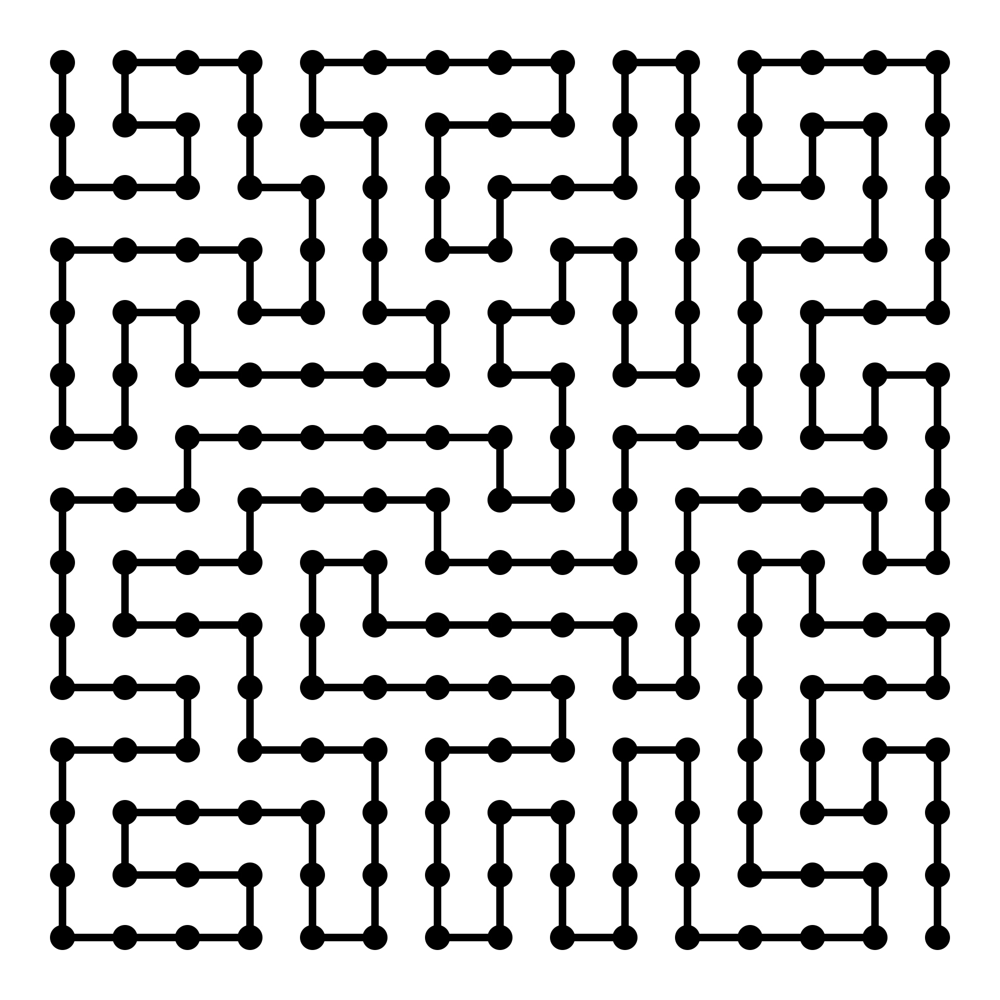

# Self-Avoiding Walk

This is my project aimed at creating a semi-optimized method for calculating all the possible random walks that fill the entire grid.

So far, the code is in Python, with C implementation hopefully coming soon.  
(For fun I'm coding the c++ version of this project from leschi4banane)

